# bg3-smart-dice-rolls

[installer-link]: https://github.com/tpetsas/bg3-smart-dice-rolls/releases/latest/download/BG3-SmartDiceRolls-Mod_Setup.exe

A mod for Baldur's Gate 3 that enables physical dice rolls via smart dice (i.e., [Pixels dice](https://gamewithpixels.com/)) for all dialogue checks!

Built with the tools and technologies:

[](https://cmake.org/)

[](https://gamewithpixels.com/)
[](https://ghidra-sre.org/)

<p align="center">

</p>

## Overview

This mod hooks into Baldur's Gate 3's dialogue roll system and bridges it with physical [Pixels smart dice](https://gamewithpixels.com/). When a dialogue check is triggered in-game, the mod notifies a companion tray app which waits for a physical die roll result — then injects that result back into the game. The outcome on screen reflects whatever you physically rolled.

The mod works with **mouse & keyboard**, **DualSense (PS5)**, and **Xbox** controllers, and supports **co-op** play.

Mod Page: [**Nexus Mods — BG3 Smart Dice Rolls Mod**](https://www.nexusmods.com/baldursgate3/mods/TODO/)

Installer: [**BG3-SmartDiceRolls-Mod_Setup.exe**][installer-link]

## Features

- Physical Pixels dice rolls for all BG3 dialogue checks
- Supports **normal**, **advantage**, and **disadvantage** rolls
- Works with **mouse & keyboard** (no controller required)
- Works with **DualSense (PS5)** controller
- Works with **Xbox** controller
- Supports **co-op** mode (multiple controllers)
- USB controller connectivity is recommended for best stability
- Tray app closes automatically when the game exits

<p align="center">
  <br><br>
  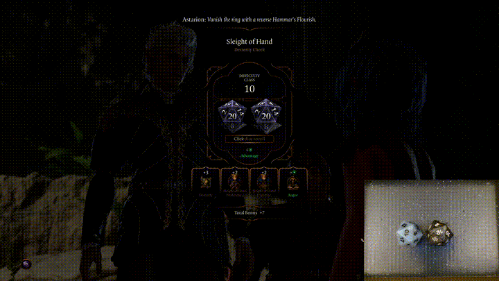
  <br>
  <em>BG3 Smart Dice Rolls Mod in action!</em>
</p>

----

## Installation

[BG3 Smart Dice Rolls Mod (latest)]: https://github.com/tpetsas/bg3-smart-dice-rolls/releases/latest

### :exclamation: Windows SmartScreen or Antivirus Warning

If Windows or your antivirus flags this installer or executable, it's most likely because the file is **not digitally signed**.

This is a known limitation affecting many **open-source projects** that don't use paid code-signing certificates.

#### :white_check_mark: What you should know:
- This mod is **open source**, and you can inspect the full source code here on GitHub.
- It **does not contain malware or spyware**.
- Some antivirus programs may incorrectly flag unsigned software — these are known as **false positives**.

Download the [BG3-SmartDiceRolls-Mod_Setup.exe][installer-link] from the latest version ([BG3 Smart Dice Rolls Mod (latest)])

Double click the installer to run it:

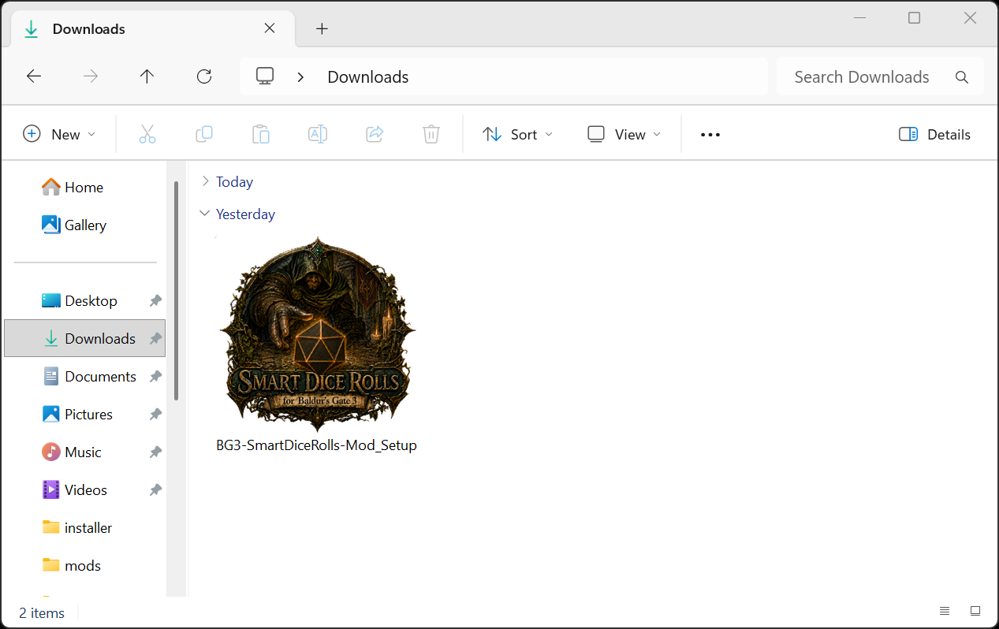

You may safely proceed by clicking:

> **More info → Run anyway** (for SmartScreen)  
> or temporarily allow the file in your antivirus software.
>
> If for any reason the "Run anyway" button is missing you can just do the process manually by:  
> Right-click BG3-SmartDiceRolls-Mod_Setup.exe → Properties → Check "Unblock" → Apply


Accept the disclaimer and click Next:

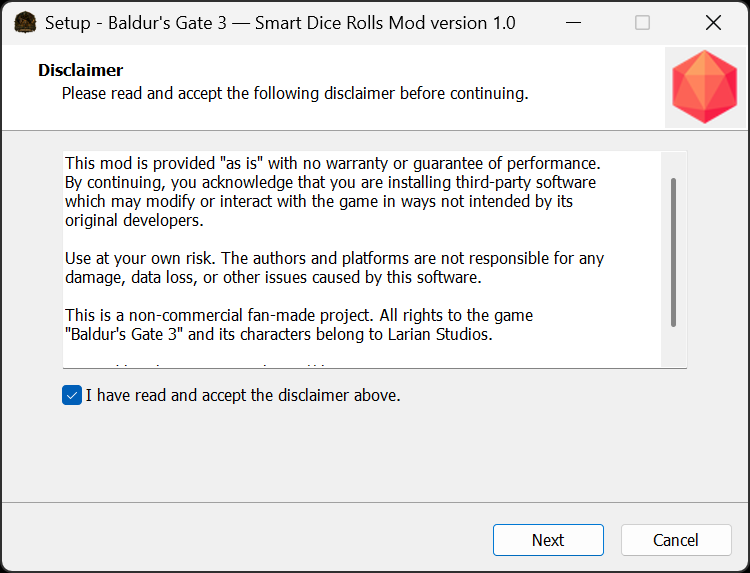

Choose your installation type (Steam, GOG, Epic, or custom path) and click Next:

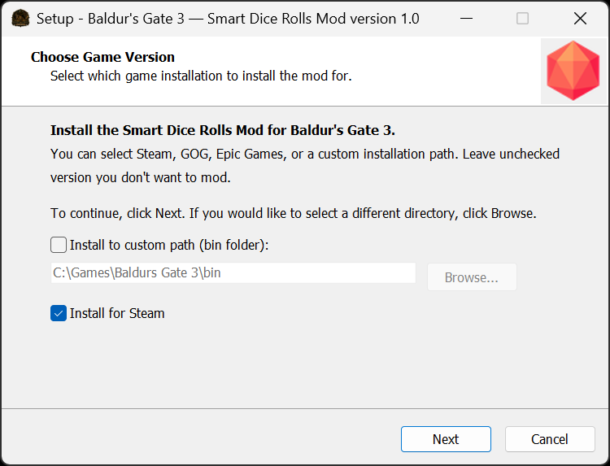

Once all steps are completed, you will reach the final screen indicating that the setup is finished:

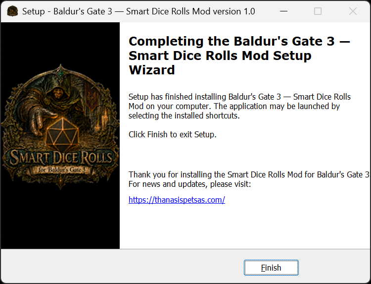

Then, the first time you install the mod, you need to configure your dice with the PixelsTray app. This step should only happen once and then the TrayApp will remember your dice. To do that, find the PixelsTray app. This should be in the `bin` directory of the game at `mods\PixelsDiceTray` path (e.g., if the game is installed from Steam, this path should be: `C:\Program Files (x86)\Steam\steamapps\common\Baldurs Gate 3\bin\mods\PixelsDiceTray`).

So, find and run the `PixelsTray` app from the game's `mods\PixelsDiceTray\` folder:

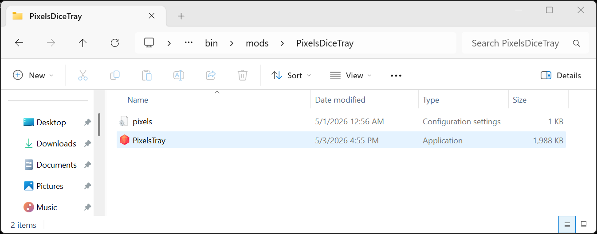

It will show that no dice configuration is found and prompt you to set up your dice. Just click "OK":

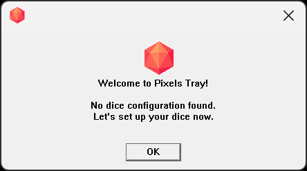

Then, wait for the app to scan and find all of your dice, and then click "Save Setup":

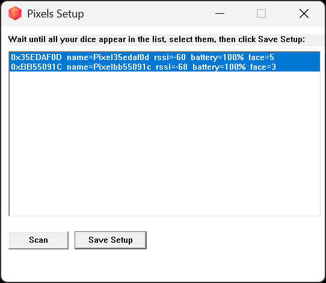

After this step, a Pixels configuration file (`pixels.cfg`) should be created in the same directory that will be used from now on by the mod each time the game starts:

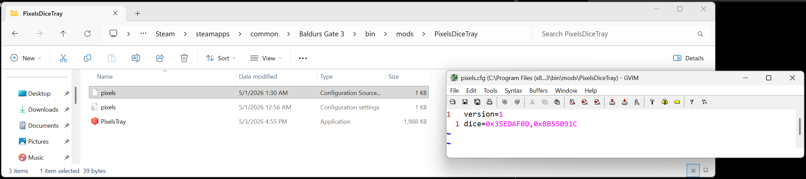

You should see the following dialog saying that the dice are ready:

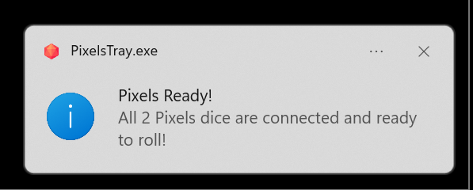

You can now start Baldur's Gate 3 and experience physical dice rolls for every dialogue check. The tray app will launch automatically when the game starts, and close automatically when the game exits.

### Manual Installation

[binaries-link]: https://github.com/tpetsas/bg3-smart-dice-rolls/releases/latest/download/BG3-SmartDiceRolls-Mod_Binaries.zip

If you prefer not to use the installer, download the mod binaries ZIP file here: [BG3-SmartDiceRolls-Mod_Binaries.zip][binaries-link] and locate the `bin` directory of the game (for Steam this is typically: `C:\Program Files (x86)\Steam\steamapps\common\Baldurs Gate 3\bin`). Extract all the files into that directory so that the structure looks like:

```
Baldurs Gate 3/
    bin/
        xinput1_4.dll
        mods/
            smart-dice-rolls.dll
            smart-dice-rolls-mod.ini
            PixelsDiceTray/
                PixelsTray.exe
                pixels.ini
```

Then unblock `PixelsTray.exe`:

Right-click `PixelsTray.exe` → **Properties → Check "Unblock" → Apply**

Finally, run `PixelsTray.exe` once to complete the first-time dice setup (follow the steps from [Find and run the PixelsTray app](#installation) onward).

## Uninstallation

To uninstall the mod, go to **Settings > Add or remove programs**, locate **Baldur's Gate 3 — Smart Dice Rolls Mod**, choose Uninstall, and follow the prompts:

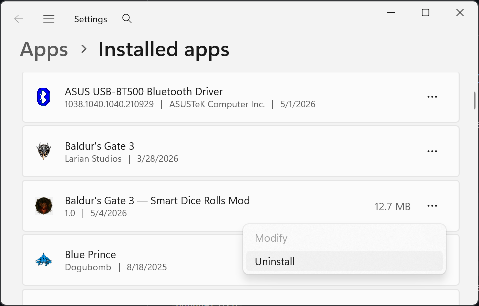

## Usage & Configuration

Once installed, the mod activates automatically when Baldur's Gate 3 is started. The companion tray app (`PixelsTray.exe`) launches alongside the game and shows live die status, recent rolls, and battery levels.

> [!IMPORTANT]
> **Steam Input must be disabled!** This is a native mod that is relying on a system library (`input1_4.dll`) to attach to the game. This means that Steam Input **must** be disabled, or otherwise the mod will not get loaded.

<p align="center">
  <br><br>
  
  <br>
  <em>Steam Input must be disabled for the mod to work</em>
</p>

This is totally fine, as Baldur's Gate 3 has great native support for most of the controllers out there.

### Configuration file

The mod can be configured via an INI file located at `<game>\mods\smart-dice-rolls-mod.ini`.

#### `[app]`

```ini
[app]
debug=false
```

Setting `debug=true` enables verbose logging to `mods\smart-dice-rolls.log` (mod DLL) and `mods\PixelsDiceTray\pixels_log.txt` (tray app). Leave it at `false` in normal use.

#### `[display]`

```ini
[display]
click_norm_x=0.50
click_norm_y=0.43
```

These control where the tray app clicks the dice roll button when using **mouse & keyboard** (no controller). The values are normalized positions within the game window (0.0 = left/top, 1.0 = right/bottom). The defaults are calibrated for a **16:9** display at default UI scale.

If the click lands off-target on your setup, adjust these values until it hits the dice button. The advantage/disadvantage X position is derived automatically as `click_norm_x - 0.03`.

> [!TIP]
> To calibrate: temporarily disconnect your Pixels dice so the tray app never receives a roll result. Trigger a dialogue roll in-game — the button will appear but the tray app won't click it. While the button is visible, hover your cursor over it and use a screen coordinate tool (e.g. the free [WinSpy](https://github.com/strobejb/winspy) or any cursor-position utility) to read the cursor's screen coordinates. Then divide by your game window dimensions: `click_norm_x = cursorX / windowWidth`, `click_norm_y = cursorY / windowHeight`.

### Controller support notes

- **DualSense (PS5)**: Input is injected directly into the HID stream. Works wired or wireless; USB is recommended.
- **Xbox**: Input is injected via a synthetic raw-input report. USB is recommended.
- **Mouse & keyboard (no controller)**: This is supported as well.
- **Co-op**: Multiple controllers are supported simultaneously.

> [!NOTE]
> USB connectivity is strongly recommended over Bluetooth for controllers. Wireless controller input can interfere with BLE and affect the roll injection timing.

## Bluetooth Adapter Note

During development and testing, the onboard Bluetooth chip of the **GIGABYTE B650 AORUS Elite** motherboard was found to have an unstable BLE (Bluetooth Low Energy) implementation — causing intermittent connectivity issues and dropped connections with Pixels dice.

The solution was to **uninstall the Realtek Bluetooth drivers and disable the onboard chip** (from both Bluetooth and Network Adapter sections in Device Manager), and switch to an external **ASUS USB-BT500** Bluetooth adapter, which works flawlessly:

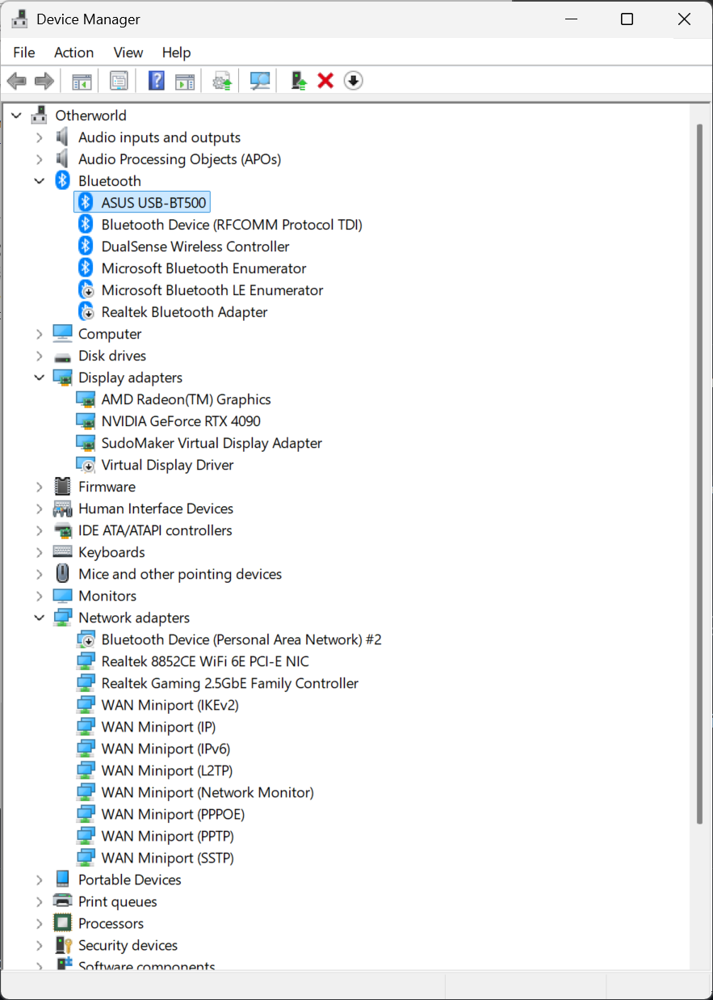

If you experience Pixels dice connectivity issues, switching to a USB Bluetooth adapter (such as the ASUS USB-BT500) is the recommended fix.

## Other things to note

> [!CAUTION]
> The Pixels dice are turned off when they are close to magnets. This is expected as this is the main mechanism used by their charging case to turn off. So beware if you use them with a dice tray that contains magnets; I myself faced connectivity issues by rolling the dice in a magnetic dice tray and was confused about that. But as I said, this is an expected behavior by Pixel's firmware.

## Issues

Please report any bugs or flaws! Enable `debug=true` in the configuration (see [Usage & Configuration](#usage--configuration)) to get a fully verbose log when reproducing the issue — both `smart-dice-rolls.log` and `pixels_log.txt` are helpful for debugging. Feel free to open an issue [here](https://github.com/tpetsas/bg3-smart-dice-rolls/issues) on GitHub.

## Credits

[GameWithPixels](https://github.com/GameWithPixels) for the original [PixelsWinCpp](https://github.com/GameWithPixels/PixelsWinCpp) C++ Pixels dice library that this project is based on!

[Tsuda Kageyu](https://github.com/tsudakageyu), [Michael Maltsev](https://github.com/m417z) & [Andrey Unis](https://github.com/uniskz) for [MinHook](https://github.com/TsudaKageyu/minhook)! :syringe:
